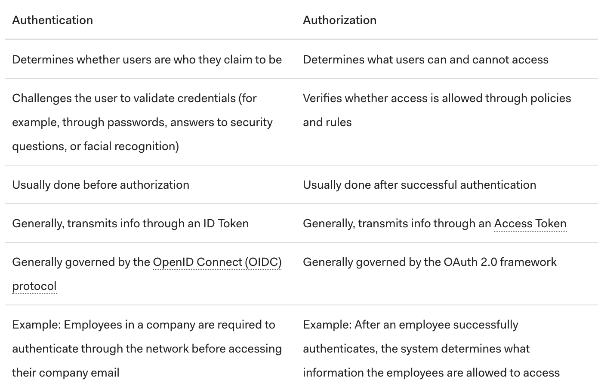

# Read 11

## What is OAuth
[link](https://www.csoonline.com/article/3216404/what-is-oauth-how-the-open-authorization-framework-works.html)

"OAuth is an open-standard authorization protocol or framework that describes how unrelated servers and services can safetly allow authenticated access to their assets without sharing the initial, related, single logon credential." (article)

An example is when you log onto a website and it offers one or more chances to log on with another website's logon. Two or more services use one transaction by the user. It makes it easier for the user because they can just use one log on. OAuth is best seen as being open authorization. OAuth is allowing the user to let another site have a limited access authentication token. A real life example is like a valet and the owner is letting the valet use their key to drive a car for a short period of time.

There are some comparisons with OAuth and OpenId, however, OpenID is about authentication. "'OpenID is for humans logging into machines, OAuth is for machines logging into machines on behalf of humans.'" (article)

The Security Assertion Markup Language (SAML) is also compared to OAuth. is a framework that allows one computer to perform both authenticationa nd authorization for one or more computers. This is more used for enterprise apps like Salesforce.

OAuth2 is less secure and more complex. 2.0 and 1.0 are not compatible.

OAuth may not be safe unless it has TLS protection. It's possible for rouge websites to phish a user's legtimate credentials.

## Authorization and Authentication flows
[link](https://auth0.com/docs/flows)

AuthO uses OpenId and OAuth2.0 to authenticate users and get authorization to access protected resources.

The differences between authenticate and authorization:

If you can't prove your identity, you are not authorized for that resource.

[<== Back](https://simoneodegard.github.io/reading-notes/)